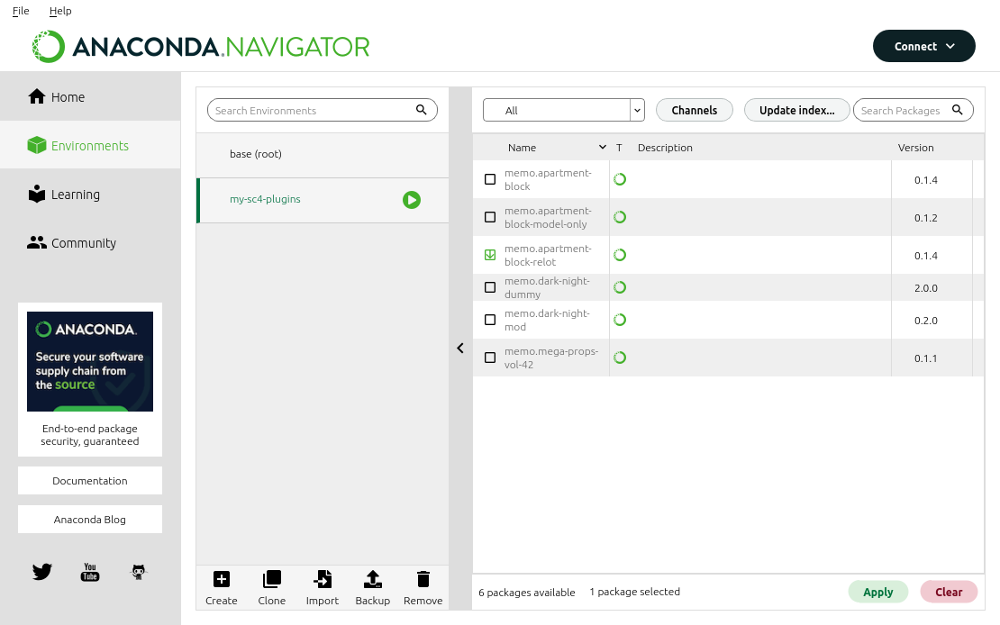
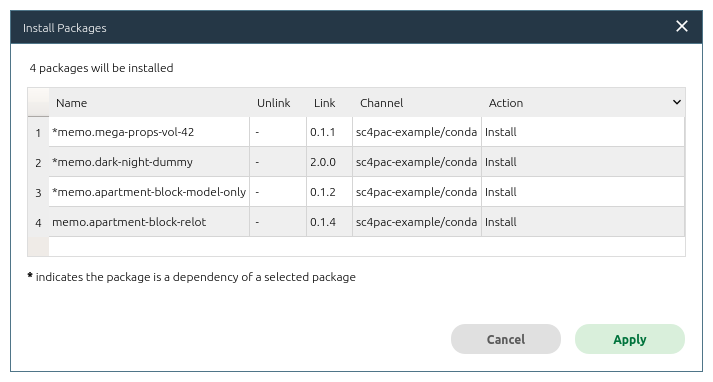

**Note:** Superseded by a new implementation: https://github.com/memo33/sc4pac-tools


A Package Manager for SC4
=========================

This is a small demonstration of how a package manager can be used to manage custom content for SimCity 4.

A **package manager** is responsible for:

- figuring out dependencies for packages you want to install,
- installing the packages into the right places in your plugins folder,
- keeping your files up-to-date and uninstalling any files that are not needed anymore.

We use an existing package manager, [Conda](https://en.wikipedia.org/wiki/Conda_(package_manager)),
which is cross-platform and comes with a graphical user interface.

This repository consists of a set of "recipes" that contain [metadata](metadata) about some custom content.
The metadata defines how to convert a zip file of a SC4 plugin into a Conda package.
The Conda packages can then be installed into your plugins folder in an automated way using the package manager.

While this demo is functional already, for this to be useful,
we need a place to host these Conda packages and/or custom content for which redistribution in this form is permitted.


Getting Started
---------------

This tutorial guides you through the installation process of the package manager
and shows how to install the first demo packages.

#### 1. Install Miniconda (Follow these steps: [Windows](https://docs.conda.io/projects/conda/en/latest/user-guide/install/windows.html)/[macOS](https://docs.conda.io/projects/conda/en/latest/user-guide/install/macos.html)/[Linux](https://docs.conda.io/projects/conda/en/latest/user-guide/install/linux.html)).

This is a minimal installation of the Conda package manager.
You can skip the step "Verify your installer hashes" if you are unfamiliar with that.
Accept all the default options during the installation process.
Usually this should install all files to `$HOME/miniconda3/`,
where `$HOME` denotes your user directory (e.g. `C:\Users\<your-username>\` on Windows).

#### 2. Install the graphical user interface `anaconda-navigator`.

In a terminal window or Anaconda Prompt, type:
```
conda install anaconda-navigator
```

#### 3. Create a new empty Conda environment named `my-sc4-plugins`.

If you have multiple plugins folders for different regions,
you could create a new environment for every plugins folder and easily switch between them.

In a terminal window or Anaconda Prompt, type:
```
conda create -n my-sc4-plugins
```
(We could also create new environments via the graphical user interface,
but those are not empty and come with several irrelevant packages preinstalled by default.)

#### 4. Launch the graphical user interface `anaconda-navigator` via the start menu or terminal.

#### 5. Choose the `Environments` tab on the left and select our environment `my-sc4-plugins`.

#### 6. Add a new channel.

Click `Channels` and add a new channel with the URL https://memo33.github.io/sc4pac-example/conda/.
Remove the `defaults` channel. Then `Update channels`.

#### 7. In the drop-down menu, choose `All`.

You now see a list of the packages in this repository. (If there are too many packages, search for `memo.`)
To avoid rehosting content, these packages are all empty, but they illustrate typical dependency relations between SC4 custom content:
prop packs, lot files, model files, dark night models…



#### 8. Select the package `memo.apartment-block-relot` and hit `Apply`.

This downloads and installs all the dependencies like props and a model file.
It does not install the original lot (`memo.apartment-block`) that came with the model, since we chose the relotted version.



The files should now have been installed to the directory `$HOME/miniconda3/envs/my-sc4-plugins/share/sc4pac/plugins/`
where you find an organized folder structure:
```
+- 100-textures-props/150-props/
|  +- memo.mega-props-vol-42-0.1.1-4/
|     |- download-links.txt
|     +- memo/
|        |- memo-mega-props-vol-42.dat
|        |- memo-mega-props-vol-42-additions.dat
+- 200-residential/270-high-density/
   +- memo.apartment-block-model-only-0.1.2-2/
   |  |- download-links.txt
   |  |- memo/memo-apartmentblock-standardnight.SC4Model
   +- memo.apartment-block-relot-0.1.4-4/
      |- download-links.txt
      |- memo/memo-apartmentblock-relotted.SC4Lot
```
This ensures a correct loading order.
(You could then datpack this folder to your actual plugins folder
or link to this folder using a hardlink or the `-UserDir:path` launch option.)

#### 9. Install `memo.dark-night-mod`.

Notice how installing the dark night mod also updates the previously installed model file `memo.apartment-block-model-only`
which comes with a dark night variant.
The standard-night model in our plugins folder is replaced by a dark-night model:
```
...
+- 180-mods/
|  +- memo.dark-night-mod-0.2.0-2/
|     |- download-links.txt
|     |- memo/memo-darknight-mod.dat
+- 200-residential/270-high-density/
   +- memo.apartment-block-model-only-0.1.2-2/
   |  ...
   |  +- memo/memo-apartmentblock-darknight.SC4Model     <-- this is the replacement model
   ...
```

This is a *huge* benefit of using a package manager, since all of this happens automatically.
The same can be done for mods that come with a CAM and a no-CAM variant.
Or a US/EU variant. Or a RHD/LHD variant.

#### 10. Click `memo.apartment-block-relot` > `Mark for removal` and hit `Apply` to uninstall.

Notice how this also uninstalls all the dependencies that are not required by any other packages anymore, including the mega props pack.


Great! You have finished the tutorial highlighting some of the key features.
Now let's collaborate and make this a reality.
